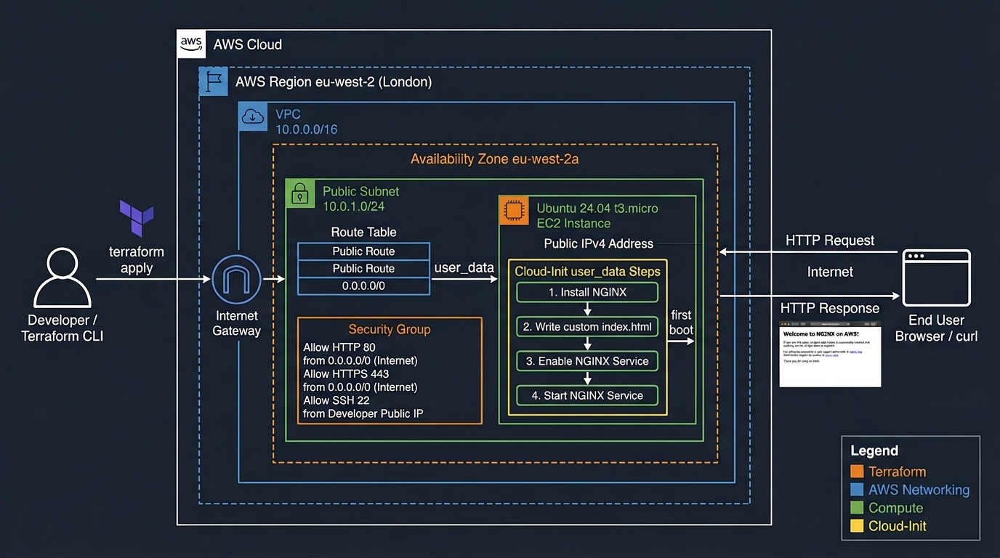

<table>
  <tr>
    <td width="70%">
      <h1>NGINX on AWS with Terraform (Cloud-Init)</h1>
    </td>
    <td width="30%" align="right">
      
    </td>
  </tr>
</table>

<h4 align="center">Automate the deployment of a NGINX Web Server on AWS using Terraform.</h4>


<p align="center">


</p>


<p align="center">
  <a href="#Overview">Overview</a> •
  <a href="#Architecture">Architecture</a> •
  <a href="#project-structure">Project Structure</a> •
  <a href="#deployment">Deployment</a> •
  <a href="#verification">Verification</a> •
  <a href="#challenges-and-solutions">Challenges</a> •
  <a href="#key-learnings">Key Learnings</a>
</p>




## Overview

This project demonstrates an end-to-end Infrastructure as Code workflow:

- Terraform provisions the AWS networking and compute resources.
- A modular structure separates network and EC2 responsibilities.
- EC2 receives `cloud-init.yaml` through Terraform `user_data`.
- Cloud-init installs NGINX, writes a custom web page, and starts the service.
- The completed deployment is accessible over HTTP without manually configuring the server after launch.

> [!NOTE]
> This project creates billable AWS resources, including an EC2 instance and networking components. Follow the cleanup section after testing to remove them when they are no longer required.

## Architecture

The deployment is created in **AWS `eu-west-2` (London)**.

```text
Terraform apply
    |
    +-- Network module
    |     +-- VPC: 10.0.0.0/16
    |     +-- Public subnet: 10.0.1.0/24
    |     +-- Availability Zone: eu-west-2a
    |     +-- Internet Gateway and public route
    |
    +-- EC2 module
          +-- Security Group
          |     +-- HTTP TCP/80 from the internet
          |     +-- HTTPS TCP/443 from the internet
          |     +-- SSH TCP/22 from my public IP only
          |
          +-- Ubuntu 24.04 EC2 instance (t3.micro)
                |
                +-- EC2 user_data
                      |
                      +-- cloud-init.yaml
                            +-- Install NGINX
                            +-- Write index.html
                            +-- Enable and start NGINX

Browser / curl --> EC2 public IPv4 --> NGINX --> Custom web page
```

> [!NOTE]
> The architecture shown here uses a public subnet and a public IPv4 address so the NGINX page can be reached directly from the internet. This is suitable for a learning project, but production workloads should normally use additional security and availability controls.

## AWS Resources

| Resource | Configuration |
|---|---|
| AWS Region | `eu-west-2` |
| VPC CIDR | `10.0.0.0/16` |
| Public Subnet CIDR | `10.0.1.0/24` |
| Availability Zone | `eu-west-2a` |
| EC2 Operating System | Ubuntu 24.04 |
| EC2 Instance Type | `t3.micro` |
| Web Server | NGINX |
| Public Connectivity | Auto-assigned public IPv4 |
| HTTP Access | TCP port `80` from `0.0.0.0/0` |
| HTTPS Access | TCP port `443` from `0.0.0.0/0` |
| SSH Access | TCP port `22` from my public IP only |

> [!WARNING]
> HTTP and HTTPS are open to the internet through `0.0.0.0/0`. This is intentional for demonstrating public web access, but do not expose administrative services such as SSH globally.

## Project Structure

```text
terraform/
├── main.tf                 # Connects the network and EC2 modules
├── provider.tf             # Terraform and AWS provider configuration
├── variables.tf            # Root input variables
├── output.tf               # Deployment outputs such as public IP/URL
├── dev.tfvars              # Local environment values — excluded from Git
├── screenshots/            # Deployment evidence
└── modules/
    ├── network/
    │   ├── main.tf         # VPC, subnet, Internet Gateway and routing
    │   ├── variables.tf    # Network module interface
    │   └── output.tf       # VPC ID and public subnet ID
    └── ec2/
        ├── main.tf         # Key pair, security group and EC2 instance
        ├── variables.tf    # EC2 module interface
        ├── output.tf       # EC2 instance outputs
        └── cloud-init.yaml # NGINX first-boot configuration
```

> [!IMPORTANT]
> `dev.tfvars`, Terraform state files, `.terraform/`, and generated `.pem` private keys must never be committed to GitHub. They are excluded through `.gitignore`.

## How It Works

### 1. Terraform provisions AWS infrastructure

The root module calls two child modules:

- **`modules/network`** creates the VPC, public subnet, Internet Gateway, and public route.
- **`modules/ec2`** creates the key pair, security group, and Ubuntu EC2 instance.

The network module exposes the VPC ID and subnet ID as outputs. The root module passes these values into the EC2 module, so Terraform understands that networking must be available before it launches the instance.

> [!IMPORTANT]
> Child modules cannot directly access resources declared in the root module or another child module. Pass required values explicitly through module input variables and outputs.

### 2. Terraform sends cloud-init as user data

The EC2 module reads the YAML file and sends it when the EC2 instance is launched:

```hcl
user_data                   = file("${path.module}/cloud-init.yaml")
user_data_replace_on_change = true
```

`user_data_replace_on_change = true` means an update to `cloud-init.yaml` triggers replacement of the EC2 instance. This matters because cloud-init is designed to run during an instance's first boot.

> [!NOTE]
> EC2 user data normally runs during the instance's first boot. Changing `cloud-init.yaml` does not automatically re-run the configuration on an existing instance unless the Terraform resource is replaced or the configuration is otherwise executed manually.

### 3. Cloud-init configures the server

The `cloud-init.yaml` file starts with `#cloud-config`, which tells Ubuntu cloud-init to interpret the user data as structured YAML instructions.

Cloud-init performs these tasks automatically:

1. Updates package metadata.
2. Installs NGINX.
3. Writes a custom `index.html` file to `/var/www/html/`.
4. Enables NGINX for future reboots.
5. Starts NGINX so it listens on HTTP port `80`.

## Prerequisites

Before deploying, ensure you have:

- An AWS account
- Terraform installed locally
- AWS CLI installed and authenticated
- IAM permissions to create VPCs, subnets, route tables, Internet Gateways, security groups, key pairs, and EC2 instances

> [!IMPORTANT]
> Use an IAM identity with only the permissions required for this project. Avoid using the AWS account root user for Terraform deployments.
Verify your AWS identity:


```bash
aws sts get-caller-identity
```

Create a local `dev.tfvars` file in the `terraform/` directory. This is intentionally excluded from version control.

```hcl
aws_region         = "eu-west-2"
environment        = "dev"
vpc_cidr           = "10.0.0.0/16"
public_subnet_cidr = "10.0.1.0/24"
availability_zone  = "eu-west-2a"
instance_type      = "t3.micro"
ssh_allowed_cidr   = "YOUR_PUBLIC_IP/32"
key_name           = "cloud-init-ec2-key"
```
> [!CAUTION]
> Never place AWS access keys, private SSH keys, passwords, or Terraform state files in `dev.tfvars` or commit them to the repository. Treat Terraform state as potentially sensitive because it may contain infrastructure details and resource attributes.

Find your current public IP with:

```bash
curl ifconfig.me
```

Then append `/32` to allow SSH only from that one IP address.

> [!WARNING]
> Do not use `0.0.0.0/0` for SSH. Restrict TCP port `22` to your trusted public IP address using CIDR notation such as `203.0.113.10/32`. If your public IP changes, update `ssh_allowed_cidr` and apply the Terraform changes.

## Deployment

Create a local `dev.tfvars` file. This file is excluded from Git because it contains environment-specific values.

```hcl
aws_region         = "eu-west-2"
environment        = "dev"
vpc_cidr           = "10.0.0.0/16"
public_subnet_cidr = "10.0.1.0/24"
availability_zone  = "eu-west-2a"
instance_type      = "t3.micro"
ssh_allowed_cidr   = "YOUR_PUBLIC_IP/32"
key_name           = "cloud-init-ec2-key"
```
> [!IMPORTANT]
> Run these commands from the directory containing the root Terraform configuration. Review the output of `terraform plan` carefully before running `terraform apply`.

Run from the `terraform/` directory:

```bash
terraform fmt -recursive
terraform init
terraform validate
terraform plan -var-file="dev.tfvars"
terraform apply -var-file="dev.tfvars"
```

## Verification

After the instance is created, wait for cloud-init to finish installing and starting NGINX.

```bash
terraform output
```

Test the HTTP endpoint:

```bash
curl -I "http://<EC2_PUBLIC_IP>"
```

Expected result:

```text
HTTP/1.1 200 OK
```

You can also open the public IP in a browser and confirm that the cloud-init-created web page is displayed.

### Verify from inside the instance

Once SSH access is configured correctly, connect to the Ubuntu instance:

```bash
ssh -o IdentitiesOnly=yes \
  -i ./keys/cloud-init-ec2-key.pem \
  ubuntu@<EC2_PUBLIC_IP>
```

Run the following validation commands:

```bash
cloud-init status --wait
sudo systemctl status nginx --no-pager
curl -I http://localhost
sudo tail -n 100 /var/log/cloud-init-output.log
```
> [!NOTE]
> Cloud-init may need several minutes to finish after the instance becomes available in the AWS console. A temporary connection failure does not necessarily mean the deployment failed; check `cloud-init status --wait` and the cloud-init logs first.

Successful deployment indicators:

```text
status: done
```

```text
Active: active (running)
```

```text
HTTP/1.1 200 OK
```

## Screenshots

Add evidence screenshots in the `screenshots/` folder after deployment.

| Screenshot | What it demonstrates |
|---|---|
| `01-terraform-plan.png` | Terraform calculates the required infrastructure changes |
| `02-terraform-apply.png` | Terraform successfully creates the resources |
| `03-terraform-outputs.png` | EC2 public IP / application URL is returned |
| `04-ec2-running.png` | EC2 is running in AWS `eu-west-2` |
| `05-nginx-page.png` | NGINX page was created automatically by cloud-init |
| `06-cloud-init-status.png` | Cloud-init completed successfully |
| `07-nginx-status.png` | NGINX is active and running |

Example image embeds:

```markdown


```


## Challenges and Solutions

| Challenge | Root cause | Resolution |
|---|---|---|
| EC2 module could not reference the VPC/subnet | Child modules have isolated scope | Exported `vpc_id` and `public_subnet_id` from the network module; passed them into the EC2 module as input variables |
| Terraform prompted for the SSH CIDR | Required variable was not supplied | Added `ssh_allowed_cidr` to the local `dev.tfvars` file and used `-var-file` |
| Module output was unavailable | An output block was missing or the output name did not match | Added the required module output and referenced the exact output name from root |
| Port `80` returned connection refused | Cloud-init had not completed, NGINX was not running, or the HTTP rule needed checking | Verified cloud-init status/logs, NGINX service status, public IP assignment, route table, and TCP/80 security-group ingress |
| SSH returned `Permission denied (publickey)` | Local private key did not match the key pair used by the instance, or an old key was reused | Verified key pair name, PEM path, key match, and the Ubuntu login user; recreated the instance with the Terraform-managed key pair when needed |


## Key Learnings
- How to use Terraform to provision AWS infrastructure declaratively.
- How to structure Terraform using a root module and child modules.
- How module input variables and outputs allow network and compute modules to communicate.
- How Terraform infers resource dependencies from output references.
- How to pass cloud-init YAML to an EC2 instance with `user_data`.
- The difference between shell-script user data and cloud-init YAML.
- How cloud-init automates package installation, file creation, and service startup at first boot.
- How to troubleshoot EC2 networking, security groups, cloud-init, NGINX, and SSH key authentication.
- Why Terraform state and generated private keys must be treated as sensitive files.

## Cleanup

> [!CAUTION]
> `terraform destroy` permanently removes the AWS resources managed by this Terraform configuration. Confirm that the selected workspace and variable file belong to this project before proceeding.

Destroy the deployed AWS resources after testing to avoid unexpected charges:

```bash
terraform destroy -var-file="dev.tfvars"
```
> [!IMPORTANT]
> After destruction, verify in the AWS console that the EC2 instance, public IP, security group, VPC, subnet, route table, and Internet Gateway were removed or are no longer generating charges.

***
